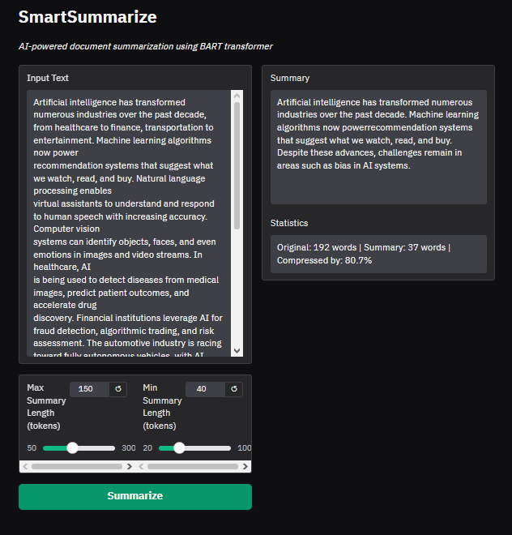

# SmartSummarize

AI-powered document summarizer using Facebook's BART-large-CNN transformer model.
## 📸 Demo



## Features

- **Abstractive summarization** using state-of-the-art BART model
- **Adjustable summary length** with min/max token controls
- **Long document support** with automatic chunking for texts exceeding model limits
- **Compression statistics** showing word count reduction
- **Web interface** built with Gradio for easy interaction

## How It Works

SmartSummarize uses the `facebook/bart-large-cnn` model, a transformer fine-tuned on the CNN/DailyMail dataset for abstractive summarization. Unlike extractive methods that copy sentences, BART generates new text that captures the key information.

For long documents that exceed BART's 1024-token context window, the text is split into chunks, each summarized individually, then the partial summaries are combined and re-summarized for a coherent final output.

## Installation

```bash
pip install -r requirements.txt
```

## Usage

### Web Interface
```bash
python app.py
# Opens at http://localhost:7860
```

### Python API
```python
from app import summarize_text

result = summarize_text(
    "Your long text here...",
    max_length=150,
    min_length=40
)
print(result["summary"])
print(f"Compressed by {result['compression_ratio']}")
```

## Tech Stack

- Python 3.10+
- HuggingFace Transformers (BART-large-CNN)
- PyTorch
- Gradio

## Author

Ines Aouissaoui
